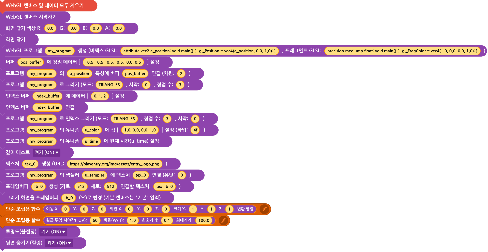

# WebGL in Entry
WebGL in Entry는 엔트리에서 WebGL API를 사용할 수 있도록 만들어진 비공식 블록입니다.

엔트리 캔버스 위에 독립적인 WebGL 캔버스를 생성하는 방식을 사용합니다.

또한 WebGL 캔버스에 `pointer-events: none`을 적용하여 WebGL 캔버스가 엔트리의 마우스 클릭을 방해하지 않도록 했습니다.

(주의: 이 프로젝트의 소스코드는 일반적인 독립 실행형 JS 파일이 아니라, **Tampermonkey** 등의 유저스크립트 환경에서 실행할 수 있도록 작성되었습니다.)

## ⚠️ 주의사항

현재 개발 중인 프로젝트이므로 버그나 예상하지 못한 오류가 발생할 수 있습니다.

WebGL 기능과 브라우저 환경에 따라 정상적으로 동작하지 않을 가능성이 있습니다.

## 🤖 개발

이 프로젝트는 Gemini 3.1 Pro와 함께 작성되었으며, 기존 엔트리 비공식 블록의 소스 코드를 참고하여 개발되었습니다.

## 🐛 버그 제보

버그나 오류를 발견했다면 GitHub의 Issues를 이용해 제보해주세요.

가능하다면 다음 정보를 함께 남겨주세요.

- 어떤 블록을 사용했는지
- 재현 방법
- 예상한 결과
- 실제 결과
- 브라우저 및 환경
- 개발자 도구 콘솔에 표시된 오류 메시지
